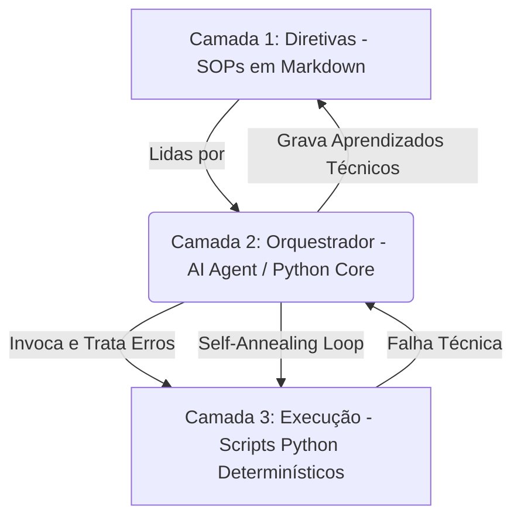

# Own Optimizer: Framework de Agentes 3 Camadas 🚀

O **Own Optimizer** é uma biblioteca Python projetada para formalizar e executar a **Arquitetura de Agentes em 3 Camadas** especificada em `AGENTE.MD`. Este framework divide os sistemas de IA em limites estruturados que mitigam a variabilidade probabilística dos LLMs ao forçar o cumprimento de diretrizes rígidas (SOPs) e a execução de códigos puramente determinísticos.

---

## 🏗️ A Arquitetura de 3 Camadas

Nossa arquitetura separa rigidamente as preocupações operacionais em três camadas estanques para maximizar a confiabilidade e robustez:



1. **Camada 1: Diretiva (SOPs em Markdown)**:
   Instruções procedimentais claras. Mapeiam o objetivo, entradas requeridas, ferramentas disponíveis e registram aprendizados de execuções anteriores.
2. **Camada 2: Orquestração (Tomada de Decisão)**:
   A inteligência que interpreta as diretivas, planeja a execução das tarefas, invoca os códigos determinísticos apropriados e realiza o **Self-Annealing Loop** (auto-ajuste) quando algo quebra.
3. **Camada 3: Execução (Trabalho Determinístico)**:
   Scripts Python independentes focados em tarefas únicas, previsíveis e testáveis (cálculos, chamadas de API, processamento de arquivos).

---

## 🛠️ Instalação Rápida

Instale a biblioteca localmente em modo editável utilizando o comando abaixo na pasta raiz:

```bash
pip install -e .
```

*Requisitos: Python >= 3.8 e `python-dotenv`.*

---

## 🚦 Guia de Início Rápido

Criamos exemplos na estrutura padrão do projeto para demonstrar o funcionamento completo da orquestração e do auto-ajuste de erros.

### 1. A Diretiva (Camada 1)
O arquivo [directives/exemplo_diretiva.md](directives/exemplo_diretiva.md) descreve o SOP para calcular impostos de vendas.

### 2. O Script de Execução (Camada 3)
O arquivo [execution/processa_vendas.py](execution/processa_vendas.py) calcula de forma determinística os valores deduzidos e reporta erros de validação.

### 3. Executando via Orquestrador (Camada 2)
Crie um arquivo Python (ex: `main.py`) na raiz do seu projeto para rodar a orquestração inteligente:

```python
from own_optimizer import Config, Orchestrator

# 1. Inicializa a Configuração e Garante Estruturas de Pasta
config = Config()

# 2. Instancia o Orquestrador
orchestrator = Orchestrator(config=config)

# 3. Inicia Sessão de Orquestração com base na nossa Diretiva Markdown
orchestrator.start_session("exemplo_diretiva")
print(f"Sessão iniciada para a diretiva: '{orchestrator.current_directive.title}'\n")

# =========================================================================
# FLUXO 1: Execução com Sucesso
# =========================================================================
print("--- Fluxo 1: Sucesso ---")
resultado_sucesso = orchestrator.execute_tool(
    script_name="processa_vendas",
    args=["--vendas", "1500", "--taxa", "0.15"]
)
print(f"Sucesso: {resultado_sucesso['success']}")
print(f"Saída: {resultado_sucesso['stdout'].strip()}\n")

# =========================================================================
# FLUXO 2: Auto-Ajuste (Self-Annealing Loop) sob Parâmetro Ausente
# =========================================================================
print("--- Fluxo 2: Teste de Self-Annealing (Parâmetro Ausente) ---")
# O script 'processa_vendas' exige o argumento '--vendas'. 
# Se omitido, a execução lança um erro contendo a palavra 'missing'.
# O orquestrador detecta a falha, executa o Self-Annealing adicionando '--debug'
# de forma automática e registra o aprendizado no arquivo Markdown!
resultado_erro = orchestrator.execute_tool(
    script_name="processa_vendas",
    args=[],  # Faltando '--vendas'
    max_retries=2
)
print(f"Sucesso após tentativas de correção: {resultado_erro['success']}")
print(f"Logs de Erro da última tentativa:\n{resultado_erro['stderr'].strip()}")

# 4. Salva a trilha de auditoria JSON na pasta temporária `.tmp/`
caminho_log = orchestrator.save_session_log()
print(f"\nSessão concluída! Histórico salvo em: {caminho_log}")
```

Ao rodar o `main.py`, note que o orquestrador atualiza fisicamente o arquivo `directives/exemplo_diretiva.md`, adicionando a seção de **Aprendizados Técnicos** com a trilha da falha!

---

## 🧪 Testes Automatizados

Garantimos a confiabilidade da biblioteca com testes unitários robustos cobrindo todas as classes do core:

```bash
python -m unittest discover -s tests
```

*Os testes criam diretórios temporários isolados para execução, mantendo seu workspace limpo.*
